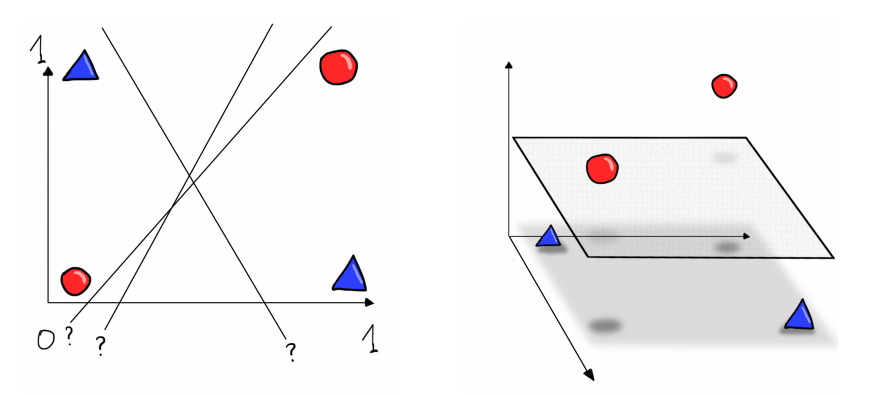

# Modelli Lineari

## Regressione Lineare
Una dipendenza lineare dell'output dall'input è molto usata come modello. Il modello è semplice e può essere allenato facilmente.

Non tutti i casi possono essere risolti con l'algebra lineare.

## Modelli lineari per la classificazione
Se il valore in uscita è una variabile che può assumere solo due valori (+1 e -1, ad esempio), una funzione lineare può essere usata come **discriminante**. L'idea è di avere un iperpiano perpendicolare al vettore *w* che separa le due classi. Un piano generalizza una linea e un iperpiano generalizza un piano dove il numero di dimensioni è maggiore di tre. L'obiettivo del training è di trovare il miglior iperpiano tale per cui gli esempi di una classe sono da una parte dell'iperpiano e gli esempi dell'altra classe sono dall'altra parte.

Esistono alcuni casi dove non è possibile fare una separazione lineare, in tal caso è necessario accettare di avere un tasso d'errore, oppure mappare i punti in modo non lineare in uno spazio con più dimensioni.

#### **Bibliografia**
- Roberto Battiti, Mauro Brunato

    [The LION way. Machine Learning plus Intelligent Optimization. Version 3.0.](https://intelligent-optimization.org/LIONbook/)
    
    LIONlab, University of Trento, Italy, 2017.