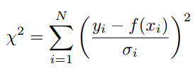

# Mastering generalized linear least-squares

## Chi quadrato
E' un test di verifica delle ipotesi utilizzato in statistica, che utilizza la distribuzione della variabile casuale Chi Quadrato per decidere se rifiutare o no l'ipotesi nulla. Si calcola con:

