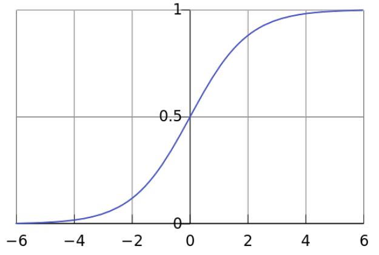

# Modelli non lineari specifici

## Regressione logistica
In statistica, è utilizzata per predire la probabilità di un output di una variabile categorica da un insieme di eventi passati registrati.

Nonostante il nome, questa è una tecnica di classificazione e non di regressione. Ma la classificazione è ottenuta tramite una stima della probabilità, da qui il termine *regressione*.

Il problema dell'utilizzo di modelli lineari è che il valore in output non è limitato: è necessario limitarlo tra *0* ed *1*.

Nella regressione logistica, la maggior parte del lavoro è fatto da un modello lineare, ma viene usata una **funzione logistica** per trasformare l'output di un predittore lineare in un valore compreso tra *0* ed *1*. L'output, infine, può essere comparato con una sogliaper ottenere una classificazione (*yes* se maggiore di *0.5*, ad esempio).

Una **curva logistica** è una funzione *funzione sigmoidea* comune. Il termine *logistica* è stato dato quando questa funzione fu introdotta per lo studio della crescita di una popolazione: il tasso di riproduzione in una popolazione è proporzionale alla popolazione esistente e alla quantità di risorse disponibili. Quando la popolazione cresce, la quantità di risorse diminuisce e diventa zero quando la popolazione raggiunge la portata del sistema. La fase iniziale della crescita è approssimativamente esponenziale. Quando la saturazione comincia, la crescita rallenta e infine si ferma.

I migliori valori per i pesi della trasformazione lineare sono determinati massimizzando la stima della verosimiglianza, cioè massimizzando la probabilità di ottenere i valori di output effettivamente ottenuti sugli esempi classificati. Le probabilità dei casi indipendenti individuali sono moltiplicate. L'espressione di verosimiglianza che si ottiene è non lineare, quindi non è possibile trovare un'espressione per i valori dei pesi che massimizzi il valore della verosimiglianza: è necessario utilizzare un proceso *iterativo*. Questo processo comincia con un tentativo, che produce una soluzione, e lo modifica leggermente, spostandosi nella direzione del gradiente negativo, per vedere se la soluzione può essere migliorata. L'obiettivo è massimizzare la generalizzazione. Questo processo va fermato presto: quando i risultati della stima della generalizzazione misurati da un set di validazione sono massimali.

## Regressione ponderata localmente
Permette di predire l'output per un nuovo input comparandolo con i più vicini esempi classificati, ritornando come output quello del più vicino, o una combinazione di un insieme selezionato degli esempi più vicini.
Questo metodo, invece che selezionare un insieme di *K* elementi, riduce gradualmente il ruolo degli esempi sulla previsione in base alla loro distanza dal caso da predire. Quando il modello è valutato su diversi punti, si utilizza la regressione lineare, ma i punti vicini sono considerati come più importanti rispetto ai distanti nella fase di training.

La **regressione ponderata localmente** è una tecnica *lazy*, basata sulla memoria: tutti i punti e le valutazioni sono archiviati e un modello specifico è costruito su richiesta solo quando un punto specificato richiede un output. Per predire l'output di una valutazione ad un punto **q**, si applica la regressione lineare ai punti di training. Per rinforzare la località nella determinazione dei parametri di regressione (i punti più vicini sono più importanti), ad ogni punto campionato viene assegnato un peso, che diminuisce con la distanza da **q**. Il peso viene chiamato *significatività* e simboleggiato con *s*.

### Regressione ponderata localmente Bayesiana
In *B-LWR*, si specificano delle *informazioni preliminari* circa quale valore dovrebbero assumere i coefficienti. La potenza delle tecniche Bayesiane deriva dall'esplicita specifica delle ipotesi e dei parametri di modellazione e la possibilitàdi modellare non solo i valori attesi, ma anche intere distribuzioni di probabilità. Per esempio, l'**intervallo di confidenza** può essere derivato per quantificare l'incertezza nei valori attesi.

## LASSO per ridurre e selezionare input
Nel considerare i modelli lineari, la *ridge regression* è un metodo per rendere il modello più stabile, penalizzando i coefficienti grandi in modo quadratico. Le stime ordinarie dei minimi quadrati hanno spesso un basso bias, ma grande varianza. L'accuratezza delle predizioni può essere migliorata riducendo o impostando alcuni coefficienti a 0, sacrificando un po' di bias per ridurre la varianza.

Quando si ha un grande numero di predittori (variabili in input), si vuole spesso identificare un piccolo sottoinsieme che abbia gli effetti più forti. Le due tecniche, feature subset selection e ridge regression, hanno alcuni inconvenienti. La tecnica **LASSO** (Least Absolute Shrinkage and Selection Operator) riduce alcuni coefficienti e ne imposta a 0 altri, cercando di ottenere le feature migliori dalle due tecniche subset selection e ridge regression.

Una delle più grandi differenze tra la tecnica LASSO e *ridge regression* è che quando viene aumentata la penalità nella ridge regression tutti i parametri vengono ridotti, ma non raggiungono mai lo zero. In LASSO, quando la penalità viene aumentata, più parametri saranno portati a zero. Gli input corrispondenti ai pesi uguali a zero possono essere eliminati, portando a modelli con meno input e quindi più interpretabili. Avere meno parametri diversi da zero riduce effettivamente il numero di variabili dalle quali la soluzione è dipendente, quindi LASSO è una tecnica per fare feature selection durante il processo di costruzione del modello.

#### **Bibliografia**
- Roberto Battiti, Mauro Brunato

    [The LION way. Machine Learning plus Intelligent Optimization. Version 3.0.](https://intelligent-optimization.org/LIONbook/)
    
    LIONlab, University of Trento, Italy, 2017.