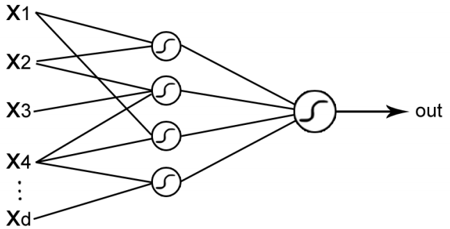
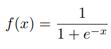
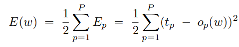

# Reti Neurali

## *MLP* Multilayer Perceptrons
Una MLP è un'architettura di modello flessibile (non parametrica). Una rete neurale MLP è composta da un gran numero di unità altamente interconnesse (*neuroni*) che lavorano in parallelo per risolvere un problema specifico, organizzati in layer con un flusso di informazioni feed-forward senza loop.

L'architettura di un MLP prevede un flusso di segnali che scorre sequenzialmente attraverso i vari layer, dall'input all'output. I layer intermedi sono detti *nascosti*, in quanto non sono visibili all'input o all'output. Per ogni layer, ogni unità calcola come prima cosa il prodotto scalare tra il vettore dei pesi e il vettore ricevuto dall'output precedente. Infine, viene applicata una *funzione di trasferimento* al risultato per produrre l'input per il prossimo layer. Una funzione regolare di trasferimento che satura molto popolare è la *funzione sigmoidale*, di cui un esempio è:

## Imparare tramite la backpropagation
Si prende una funzione che deve essere ottimizzata e si usa la *gradient descent*. Si itera, calcolando il gradiente della funzione rispetto ai pesi e facendo piccoli passi nella direzione del gradiente negativo; se il gradiente è diverso da 0 esiste un passo sufficientemente piccolo nella direzione del gradiente negativo che diminuirà il valore della funzione. Questo processo si chiama **backpropagation** (retropropagazione dell'errore). La funzione dell'energia della somma delle differenze al quadrato è:

Dove *t* è il target, *o* è il valore dell'output corrente rispettivo al pattern *p*.