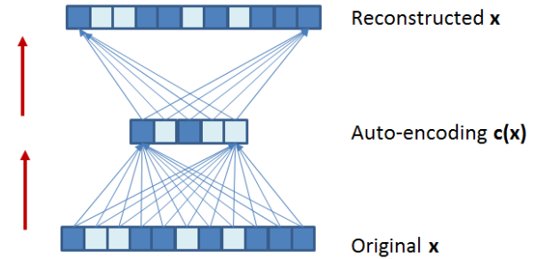
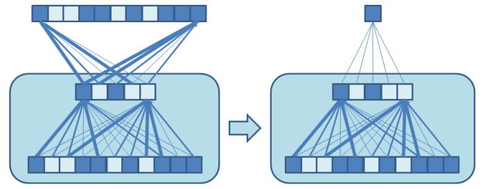

# Deep and convolutional networks
L'obiettivo delle *depp and convolutional networks* è quello di creare un sistema in modo completamente automatico a partire da dati abbondanti, senza l'aiuto umano di esperti per l'estrazione delle feature utili.

## Deep networks
Una deep neural network è una rete MLP con molti layer nascosti. Il fatto che un layer nascosto in una MLP sia sufficiente per l'esistenza di un'approssimazione non significa che costruire questa approssimazione sia facile. L'obiettivo è quello di avere una MLP che sviluppi automaticamente la sua rappresentazione interna, ricevendo in pasto degli esempi.

Esistono alcuni ostacoli pratici a questo approccio. Quando si applica la backpropagation ad una rete MLP con molti layer nascosti, le derivate parziali associate ai pesi dei primi strati tendono ad essere molto piccole e quindi soggette a problemi di stima numerica. In altre parole, cambiando un peso nel primo layer, l'effetto sarà propagato attraverso molti layer successivi e sarà confuso tra molti effetti di centinaia di altre unità. In alcuni casi, la rappresentazione interna nei primi layer non sarà molto differente da quella che si otterrebbe impostando i pesi in maniera randomica e lasciando ai livelli più alti il compito di fare il lavoro utile. Inoltre, dato che il numero di parametri è molto superiore al numero di esempi, l'overtraining diventa pericoloso: si rischia di ottenere un sistema che accomoda gli esempi, senza estrarne le regolarità rilevanti essenziali per la *generalizzazione*.

Lo schema delle ultime applicazioni è:
1. Utilizzare l'apprendimento non supervisionato da molti esempi non classificati per preparare uno stato iniziale della deep network.
2. Utilizzare la backpropagation solamente per le messa a punto finali con un insieme di esempi classificati.

### Auto-encoder
Un buon modo per costruire la rappresenzazione interna in modo non supervisionato è utilizzare gli auto-encoder. Si costruisce una rete con un unico layer nascosto il cui output riproduce semplicemente l'input, comprimendo le informazioni dell'input in una *codifica* c(x) con meno variabili dell'originale.

Una volta che l'auto-encoder è stato costruito, si può trapiantare la struttura del layer nascosto ad una seconda rete intesa alla classificazione.

Fino a questo punto è stato creato un unico layer nascosto; per crearne altri è sufficiente reiterare comprimendo la prima codifica *c(x)* con un auto-encoder, per sviluppare una seconda codifica più compressa *c'(c(x))*. I nuovi pesi risultanti dall'auto-encoding possono essere utilizzati per inizializzare un secondo layer della rete.