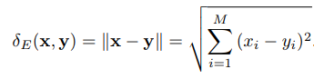
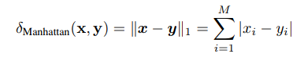
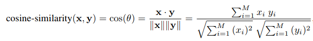
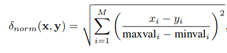
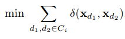
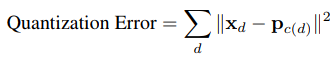
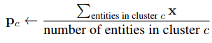
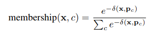
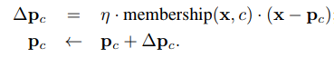
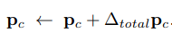

# Clustering top-down
Fino ad ora si è considerato l'apprendimento supervisionato, ma cosa è possibile fare senza un insegnante e degli esempi classificati?

Il **clustering** ha a che fare con la compressione di informazioni. I metodi di clustering lavorano raggruppando i punti simili in maniera intelligente e guidata dai dati, di modo da concentrare l'attenzione su un piccolo insieme di prototipi rilevanti. I prototipi riassumono le informazioni contenute nel sottoinsieme di casi che rappresentano. Raggruppando i casi simili si può ragionare per gruppi, invece che per entità individuali, riducendo il numero di differenti possibilità.

## Gli approcci per l'apprendimento non supervisionato

### Top-down
Si parte decidento un numero di classi e si procede separando i vari casi nelle classi differenti, mettendo i casi simili insieme. Le classi non hanno delle etichette, l'unica cosa che conta è la suddivisione.

### Bottom-up
Si inizia unendo gli elementi più simili e, quando sono stati creati dei gruppi di elementi simili grandi, si procede unendo i gruppi più simili. Il processo si ferma quando la divisione è sensata in rispetto a delle metriche specifiche, all'area di applicazione o ad un giudizio di un utente.

### Riduzione della dimensionalità
E' una strategia flessibile per l'apprendimento non supervisionato, che prevede di ridurre il numero di coordinate che descrivono un insieme di dati sperimentali; per farlo è necessario capire la struttura e la direzione della variazioni delle classi differenti. Ad esempio, se si stano processando delle immagini di facce umane, si possono considerare il colore degli occhi, la distanza tra il naso e la bocca, ... Il numero di questi parametri è sicumamente minore del numero totale di pixel dell'immagine.

## Clustering: rappresentazione e metrica
Ci sono due contesti nel clustering, dipendenti da come sono organizzate le entità.

### Rappresentazione interna
In alcuni casi si parte dalla rappresentazione interna di ogni entità e si derivano le diversità o le similitudini dalla rappresentazione interna. In questo modo è possibile derivare dei **prototipi** per ogni cluster, per esempio facendo la media delle caratteristiche delle entità in esso contenute.

### Rappresentazione esterna
In altri casi sono disponibili solo le diversità della rappresentazione esterna e il modello risultante è un grafo pesato e non orientato delle entità connesse.

L'efficacia di un metodo di clustering dipende dalla **metrica della somiglianza**, cioè il metodo con cui si misurano le somiglianze.
Se è presente una rappresentazione interna, una metrica può essere derivata dalla **distanza Euclidea**:

dove *x* e *y* sono le entità di cui si vogliono misurare le differenze.

Un altro metodo possibile è il **Manhattan**:

Un'altra possibilità è partire dalle similitudini date dal prodotto scalare di due vettori normalizzati e prendendo l'inverso per ottenere le differenze. Si chiama **coseno di similitudine**:

Il metodo del coseno di similitudine dipende solamente dalla **direzione** dei due vettori e non cambia se i componenti sono moltiplicati per una costante, mentre la distanza Euclidea cambia. Nel caso in cui si confrontano valori con differenti unità di misura, la distanza Euclidea non è efficacie. E' comunque possibile normalizzare i valori per renderli *adimensionali*, utilizzando:

dove *M* è il numero di coordinate e *minval i* e *maxval i* sono il valore minimo e massimo raggiunto dalle coordinate *i* per ogni entità.

## K-means

### Hard clustering
Partiziona le entità *D* in *k* sottoinsiemi disgiunti *C = {C1, ..., Ck}* per raggiungere i seguenti obiettivi:
- Minimizzazione delle differenze medie all'interno del cluster. .
- Massimizzazione della distanza all'esterno del cluster; si vuole che i differenti cluster siano separati nettamente.

Il processo di clustering ha come obiettivo l'ottimizzazione, quindi non sempre si vuole raggiungere il meglio possibile dei due obiettivi sopra, ma viene lasciato all'utente finale il compito di stabilire i pesi dell'importanza di ottenere cluster con entità molto simili o cluster ben separati.

#### Algoritmi divisivi
Sono gli algoritmi di clustering più semplici. Partono dall'intero insieme e procedono dividendolo via via in cluster più piccoli. Un metodo semplice è quello di scegliere un numero *k* di cluster in cui dividere l'insieme di partenza. Se il risultato non è soddisfacente è possibile riapplicare l'algoritmo con un valore k differente.

Se si vuole rappresentare un gruppo di entità con un singolo vettore si può selezionare un prototipo che minimizza la quantità d'errore media, calcolata con la formula:

dove *c(d)* è il cluster associato con i dati *d*.

In statistica e nel machine learning, il *clustering k-means* partiziona le osservazioni in *k* cluster, rappresentati da **centroidi** (prototipi per il cluster), di modo che ogni osservazione appartenga al cluster con il centroide più vicino. Il metodo iterativo per determinare un prototipo è:
1. Scegliere un numero di cluster *k*.
2. Generare randomicamente k cluster e determinare i vari centroidi. In alternativa, prendere randomicamente k esempi di training come centroidi dei cluster.
3. Ripetere i seguenti step finchè non è raggiunto un criterio di convergenza (per esempio quando l'ultima assegnazione non è cambiata), o se si raggiunge un numero massimo di esecuzioni:
   - Assegnare ogni punto *x* al cluster con il centroide più vicino.
   - Ricalcolare il centroide del nuovo cluster facendo la media dei punti assegnati nello scorso step: 

### Soft clustering
L'appartenenza ad un cluster può essere definita con una funziona decrescente delle dissomiglianze, per esempio:

Per aggiornare i centroidi dei cluster si può procedere utilizzando un *batch* o un *aggiornamento online*.

Nell'aggiornamento online si considera ripetutamente un'entità *x*, ad esempio estraendola casualmente dall'intero insieme, si deriva la sua appartenenza al cluster e si aggiornano tutti i prototipi, in modo che i prototipi più vicini tendano a diventare ancora più vicini all'entità data *x*:

Nell'aggiornamento *batch*, per prima cosa si sommano i contributi di aggiornamento su tutte le entità per ottenere il *∆ totale* del prototipo e poi si procede come segue:

