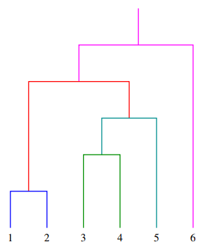
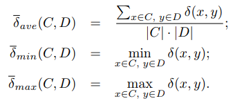
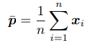
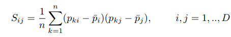
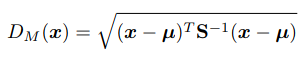
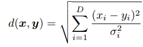

# Clustering bottom-up
I metodi di clustering necessitano il settaggio di molti parametri, come il numero *k* di cluster. Un modo per evitare di dover scegliere il numero di cluster a priori consiste nel costruire progressivamente dei cluster più grandi in maniera gerarchica; in questo modo si lascia la decisione di stabilire il numero di cluster e della loro dimensione appropriati ad un'analisi successiva. Questo metodo si chiama **clustering bottom-up agglomerativo**.

Gli algoritmi gerarchici trovano i cluster successivi utilizzando i cluster precedentemente stabiliti, partendo considerando ogni elemento come un cluster separato ed unendoli successivamente in cluster più grandi; ad ogni step i gruppi più simili sono uniti.

## Criteri di unione e dendogrammi
- **Dendogramma**: è uno strumento grafico per la visualizazione del processo di raggruppamento degli elementi e dei gruppi nelle tecniche di clustering. E' un albero con le entità originali alla base e le unioni sono rappresentate con delle linee orizzontali che connettono i due cluster fusi.

Anche il clustering bottom-up necessita di una misura della distanza per guidare il processo. La misura rilevante è la distanza tra due cluster *C* e *D* appartenenti alla collezione di cluster corrente. La distanza può essere calcolata in tre modi differenti, è possibile calcolare la distanza media, minima o massima come segue:

L'algoritmo procede con i seguenti step:
1. Trova *C* e *D* con la distanza minima.
2. Sostituisce *C* e *D* con la loro unione *C ∪ D* e registra la distanza per la quale è avvenuta l'unione.

L'algoritmo termina quando un singolo cluster contiene tutte le entità. La cronologia delle unioni gerarchiche del processo può essere rappresentata graficamente con un *dendogramma*.

### Una distanza adattata alla distribuzione dei punti: *Mahalanobis*
E' largamente utilizzata per tenere in considerazione la distribuzione dei dati quando si misurano le dissomiglianze. Dopo che un insieme di punti è stato raggruppato in un cluster, si vorrebbe descrivere l'intero cluster in termini quantitativi, invece che considerare solamente il gruppo di punti. Inoltre, dato un nuovo punto di test in uno spazio Euclideo n-dimensionale, si vuole stimare la probabilità che appartenga al cluster.

Un primo step è quello di calcolare la media dei centri di massa dei punti campionati. Intuitivamente, più il centro di massa del nuovo punto è vicino a questa media, più è probabile che appartenga all'insieme. Tuttavia, è anche necessario sapere se l'insieme è distribuito su un intervallo ampio o ristretto, per decidere se una distanza dal centro di massa può essere considerata grande o no. Un approccio semplicistico può essere quello di calcolare la deviazione standard *σ* delle distanze dei punti di campionamento dal centro di massa e confrontarla con una deviazione standard predefinita. Questo approccio può essere reso *quantitativo* definendo la **distanza normalizzata** tra due punti di test e l'insieme come *(x − µ)/σ*.

Considerando un cluster *C = {x1, ..., xn}* in *D*-dimensioni, il centro del cluster è:

Le componenti della matrice della covarianza sono definiti come:

La distanza Mahalanobis del vettore *x* da un insieme di valori con media  *µ* e matrice di covarianza *S* è definita come:

Se la matrice della covarianza è la matrice identità, la distanza Mahalanobis si riduce alla distanza Euclidea. Se la matrice della covarianza è diagonale,, allora la misura della distanza risultante è chiamata **distanza Euclidea normalizzata**:

dove *σi* è la deviazione standard di *xi* nell'insieme dei campionamenti.