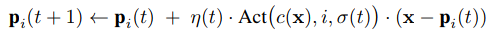
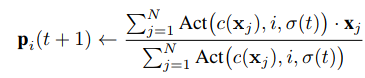
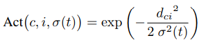
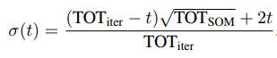
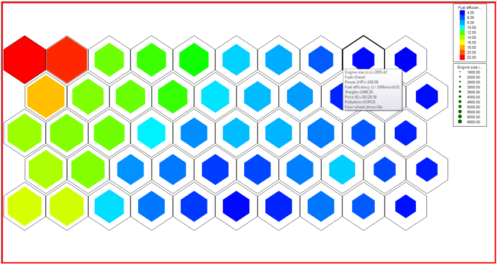

# Self-organizing maps

**Nota**: questo intero capitolo **non** sarà richiesto all'esame.

Il clustering identifica dei gruppi di dati simili, in alcuni casi con una struttura gerarchica. Se è disponibile una rappresentazione interna, è possibile rappresentare ogni gruppo con un prototipo. In questo capitolo si tratterà di prototipi organizzati secondo una struttura a griglia regolare e di come si influenzano a vicenda se sono vicini nella griglia. L'idea è di fare un clustering dei dati e, allo stesso tempo, di visualizzare questa struttura del cluster su una mappa bidimensionale.

Per problemi con alte dimensioni (con più di due coordinate) non esiste una soluzione esatta, ma si mira ad un'approssimazione che sufficiente per ragionare sui dati.

Una *self-organizing map* (**SOM**) è una rete neurale artificiale allenata utilizzando l'apprendimento non supervisionato per produrre una rappresentazione bidimensionale dei campioni di allenamento, chiamata mappa. Questo modello si chiama *Kohonen map*.

## Una corteccia artificiale per mappare entità in prototipi
Una self-organizing map consiste di nodi componenti, o neuroni. La disposizione dei nodi è un piazzamento regolare in una griglia bidimensionale. La griglia può anche essere esagonale, così che ogni nodo abbia 6 vicini, invece che 4. Ad ogni nodo *i* viene associato un vettore prototipo *Pi*, della stessa dimensione dei vettori dei dati in input, ed una posizione nello spazio della mappa.

C'è un'analogia con il nostro sistema neurale: i neuroni sono organizzati secondo una rete fisica di connessioni nel cervello bi- o tri-dimensionale; inoltre, i neuroni che sono vicini tendono a reagire ad input simili.

Ogni cella nelle due dimensioni corrisponde ad un neurone e contiene un vettore prototipo; una entità generica sarà mappata nel neurone con il vettore prototipo più *vicino* a quello che descrive l'entità stessa. L'allenamento inizia con una configurazione iniziale casuale dei vettori prototipo e itera presentando e mappando casi selezionati casualmente. Il neurone *c(x)*, anche chiamato c, è definito come quello che ha il prototipo più vicino al vettore *x*, che descrive il caso corrente:

Dopo aver assegnato un caso ad un neurone, il neurone viene aggiornato per risultare più simile al caso appena aggiunto alla rete. In aggiunta, anche i prototipi dei neuroni vicini vengono aggiornati in maniera simile, in peso sempre minore via via che la distanza aumenta.

Ad ogni iterazione *t*, viene estratta un'entità casuale *x*, viene determinato il neurone più vicino *c* e tutti i vettori prototipo *Pi(t)* vengono modificati come segue:

dove *η(t)* è un tasso di apprendimento dipendente dal tempo,  *Act(c, i, σ(t))* è una funzione di attivazione che dipende dalla distanza tra due neuroni nella griglia 2D e da un raggio *σ(t)*, dipendente dal tempo. Per aiutare la convergenza, generalmente il tasso di apprendimento e il raggio decrescono col tempo.

Nel *batch training*, tutte ne *N* entità *xi* sono presentate nella SOM ed i loro neuroni c(xi) sono identificati prima di procedere con l'aggiornamento come segue:

Ogni prototipo è aggiornato con una media pesata di tutte le entità, con il peso proporzionale alla vicinanza nella griglia.

Data la complessità del sistema, si è incoraggiati a provare parametri differenti e differenti orari finchè non si ottiene un risultato accettabile. Per esempio, una funzione di attivazione adatta può essere:

dove *d* è la distanza tra due neuroni nella griglia bidimensionale e *σ(t)* è il raggio di vicinanza.

Sia *TOT SOM* il numero totale di neuroni nella SOM e *TOT iter* il numero totale di iterazioni eseguite, allora:

## Utilizzare una SOM matura per la classificazione
Una SOM può essere utilizzata anche come guida per ragionare sul problema. Dopo il training la SOM può essere utilizzata per classificare nuovi oggetti, identificando il prototipo più vicino ed assegnando l'oggetto alla corrispondente cella. In molti casi, guardando ai prototipi è più facile dare un nome alle differenti celle, per aiutare il ragionamento. Può capitare che le celle rivelino combinazioni inusuali, portando ad interessanti intuizioni e alla rivelazione di nuovi gruppi.

Nella SOM, la qualità del training può essere misurata con la **quantizzazione dell'errore**, cioè l'errore medio in cui si incorre sostituendo un'entità *x* con il vettore prototipo più vicino *Pc(x)*, o con l'**errore topologico**, che è correlato alla mancata assegnazione di vettori vicini nello spazio alto-dimensionale originale a vettori vicini nello spazio della griglia dei neuroni (generalmente bidimensionale). L'errore topologico può essere calcolando come la frazione di tutti i vettori di dati per i quali il primo ed il secondo prototipo più vicino (nello spazio multidimensionale originale) non sono rappresentati da neuroni adiacenti nella mappatura a griglia.

La codifica a colori può essere utilizzata per rappresentare il valore dei punti dei dati in una dimensione, mentre la grandezza di ogni esagono può rappresentare il valore lungo l'altra dimensione. Le mappe colorate sono chiamate *componenti* o *piani componenti* e possono essere confrontate per identificare relazioni locali.

