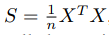
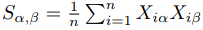
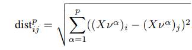
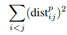
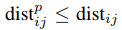
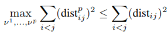
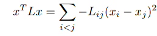
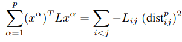
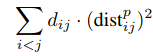
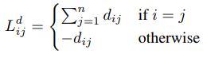

# Dimensionality reduction by projection
Nell'analisi esplorativa dei dati si utilizza l'apprendimento non supervisionato per identificare pattern e relazioni nei dati. Spesso è utile mappare le entità in due dimensioni, per poterle analizzare con i nostri occhi. Il mapping deve preservare il più possibile le informazioni rilevanti presenti nei dati originali, descrivendo le *similitudini* e le *diversità* tra le entità. Si vuole organizzare le entità in due dimensioni in modo che gli oggetti *simili* siano vicini gli uni con gli altri e gli oggetti *dissimili* siano lontani gli uni dagli gli altri. Questo si differenzia da una SOM in quanto, nelle SOM, le coordinate dei vettori prototipo associati ad una griglia bidimensionale vengono modificate per coprire lo spazio dati originale, mentre qua i punti originali sono mappati in maniera differente su una superficie bidimensionale.

Le informazioni iniziali possono essere date al sistema in due modi:
- **Struttura interna**: le entità sono caratterizzate da una struttura interna (un vettore di coordinate). In questo caso le coordinate possono essere utilizzate per derivare una misura della similitudine, per esempio con la distanza Euclidea tra due vettori.
- **Struttura esterna delle relazioni delle coppie** espressa dalle similitudini e dalle diversità. Date *n* entità caratterizzate da delle dissomiglianze reciproche *δ ij*, un modello adatto è un grafo non orientato, dove ogni entità è rappresentata da un nodo e una connessione di peso *δ ij* è presente tra due entità solo se tale peso è definito tra le due entità corrispondenti. L'insieme degli archi del grafo è chiamato *E*.

## Proiezioni lineari
Sia *n* il numero di entità e *m* la dimensione di ogni vettore (il numero di coordinate). Per comodità, gli *n* vettori possono essere memorizzati in una matrice *X* grande *m x n*. Gli indici *i e j* spaziano sui dati, mentre *α e β* spaziano sulle coordinate e si assume che i dati siano *centrati* sullo 0. Con *S* viene denotata la matrice *m x m* della *biased covariance*:

con componenti:

Questa matrice misura come due coordinate tendono a variare insieme per differenti punti. La somma della covarianza avrà un grande valore positivo se i valori positivi della prima coordinata tendono ad essere accompagnati da valori positivi nella seconda coordinata, e lo stesso trend tende ad essere vero per i valori negativi. Il valore della covarianza varia se i valori di una coordinata vengono moltiplicati per una costante. Una misura che non dipende dai cambiamenti nella dell'unità fisica è il *coefficiente di correlazione*, derivato dividendo la covarianza per un prodotto della deviazione standard delle coordinate coinvolte.

Considerando una trasformazione lineare *L* degli elementi in uno spazio di dimensione *p*, *L* è rappresentata da una matrice *p x m*, che agisce sul vettore *x*con la moltiplicazione matriciale *y = Lx*.

## PCA: Principal Components Analysis
PCA trova la proiezione ortogonale che massimizza la somma di tutte le distanze a coppie al quadrato. La distanza tra la proiezione di due punti dei dati *i* e *j* è:

PCA massimizza:

L'obiettivo è quello di diffondere i punti il più possibile, ma il fatto che si considera la proiezione implica che le distanze reciproche non possono essere aumentate oltre le originali:

Il meglio che si può ottenere è approssimare il più possibile la somma delle distanze originale:

### Laplacian matrix
E' uno strumento per descrivere relazioni di coppia tra entità. In generale, è una matrixe *n x n*, simmetrica, positiva e semidefinita, con la somma delle righe e delle colonne uguale a 0. La sua utilità risiede nel fatto che è possibile utilizzarla per esprimere in maniera compatta la somma pesata delle distanze reciproche al quadrato:

Considerando il vettore delle coordinate *p*:

### PCA pesata: combinare coordinate e relazioni
**Nota**: questo paragrafo **non** sarà richiesto all'esame.

In alcuni casi sono disponibili informazioni aggiuntive riguardanti i dati, sotto forma di relazioni fra entità. Per esempio, potrebbero essere disponibili delle etichette che assegnano alcune entità a delle classi e si vuole che esse siano vicine come distanza nella proiezione. Oppure potrebbero essere disponibili delle informazioni aggiuntive riguardanti le dissimilitudini più dettagliate di quelle ottenibili dalle coordinate dei dati. Per esempio, è possibile minimizzare una somma pesata delle distanze nella proiezione al quadrato:

E' possibile assegnare il problema ad una Laplacian matrix *n x n*:

Nella PCA supervisionata, con etichette di appartenenza a differenti classi, è possibile impostare il valore di *d ij* ad un piccolo valore *e* se *i* e *j* appartengono alla stessa classe, oppure ad 1 se appartengono a classi differenti. Questa pesatura istruisce la proiezione sul fatto che è più importante impostare larghe distanze tra punti di differenti cluster. Se *e* è 0, la struttura interna di ogni cluster è impostata solo indirettamente secondo le relazioni inter-cluster dei suoi membri.